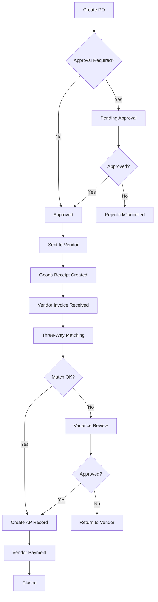

# Purchase-to-Pay Integration Analysis

## Document Purpose
This document maps all integration points between the new Purchase-to-Pay system and existing modules (Expense, Asset, Project, Accounting). It defines data flows, journal entry automation, and implementation requirements.

---

## 1. MODULE INTEGRATION MAP

### 1.1 Vendor Module (NEW)
**Purpose**: Central vendor master data management

**Integration Points**:
```
Vendor
  ├─→ PurchaseOrder (1:N) - Vendor can have multiple POs
  ├─→ GoodsReceipt (1:N) - Vendor delivers goods
  ├─→ VendorInvoice (1:N) - Vendor sends invoices
  ├─→ AccountsPayable (1:N) - AP records per vendor
  ├─→ VendorPayment (1:N) - Payments made to vendor
  ├─→ Expense (1:N) - Link legacy expenses to vendors
  └─→ Asset (1:N) - Link assets purchased from vendors
```

**Business Rules**:
- Vendor must be active before creating PO
- PKP status determines PPN calculation rules
- NPWP required for PKP vendors
- Payment terms default from vendor master

---

### 1.2 Purchase Order Flow



**Integration with Existing Modules**:

#### 1.2.1 PO → Project Integration
```typescript
// When creating PO
PurchaseOrder {
  projectId: string (optional)
  project: Project
}

// Business Rules:
// - PO linked to project for budget tracking
// - Project.estimatedBudget validates PO total
// - Project WIP updated when PO approved (PSAK 57)
```

#### 1.2.2 PO → Expense Integration
```typescript
// Manual expense can reference PO
Expense {
  purchaseOrderId: string (optional)
  purchaseType: DIRECT | CREDIT | FROM_PO
  purchaseSource: MANUAL | FROM_PO | FROM_VENDOR_INVOICE
}

// Workflow:
// 1. User creates expense manually (legacy flow)
//    - purchaseSource: MANUAL
//    - purchaseType: DIRECT (paid immediately) or CREDIT (pay later)
//    - vendorId: optional FK to Vendor master
//
// 2. Expense auto-created from PO/VI (new flow)
//    - purchaseSource: FROM_VENDOR_INVOICE
//    - purchaseOrderId: linked
//    - vendorInvoiceId: linked
```

#### 1.2.3 PO → Asset Integration
```typescript
// PO for capital assets
PurchaseOrderItem {
  itemType: GOODS | SERVICE | ASSET | EXPENSE
  assetId: string (optional) // Link to Asset master
}

// Workflow:
// 1. Create PO with itemType = ASSET
// 2. On GR completion → Create Asset record
// 3. On VI approval → Update Asset.purchasePrice
// 4. Trigger depreciation schedule creation

Asset {
  vendorId: string (FK to Vendor)
  purchaseOrderId: string (FK to PO)
  goodsReceiptId: string (FK to GR)
  vendorInvoiceId: string (FK to VI)
}
```

---

### 1.3 Three-Way Matching Logic

**Purpose**: Validate Vendor Invoice against PO and Goods Receipt

```typescript
interface ThreeWayMatch {
  purchaseOrder: PurchaseOrder
  goodsReceipt: GoodsReceipt
  vendorInvoice: VendorInvoice
  tolerance: {
    priceVariancePercent: 5  // ±5% tolerance
    quantityVariancePercent: 5
  }
}

// Matching Algorithm:
function performThreeWayMatch(vi: VendorInvoice): MatchingResult {
  const po = await getPO(vi.poId)
  const gr = await getGR(vi.grId)

  const results = vi.items.map(viItem => {
    const poItem = findPOItem(po.items, viItem.poItemId)
    const grItem = findGRItem(gr.items, viItem.poItemId)

    // Check price variance
    const priceVariance = ((viItem.unitPrice - poItem.unitPrice) / poItem.unitPrice) * 100
    const priceMatch = Math.abs(priceVariance) <= 5

    // Check quantity variance
    const quantityVariance = ((viItem.quantity - grItem.acceptedQuantity) / grItem.acceptedQuantity) * 100
    const quantityMatch = Math.abs(quantityVariance) <= 5

    return {
      lineNumber: viItem.lineNumber,
      priceMatch,
      quantityMatch,
      priceVariance,
      quantityVariance,
      isMatched: priceMatch && quantityMatch
    }
  })

  const allMatched = results.every(r => r.isMatched)

  return {
    matchingStatus: allMatched ? 'MATCHED' : 'VARIANCE',
    withinTolerance: allMatched,
    results
  }
}
```

**Matching Status Flow**:
```
UNMATCHED → MATCHED → APPROVED → (Create AP Record)
         ↘ VARIANCE → Manual Review → APPROVED/FAILED
```

---

## 2. ACCOUNTING INTEGRATION

### 2.1 Journal Entry Automation Points

#### Point 1: PO Approved (Optional - Commitment Accounting)
```typescript
// TransactionType: PO_APPROVED
// DR: 1-3010 (PO Commitments - Expense) or 1-4010 (PO Commitments - Asset)
// CR: 2-1020 (PO Commitments - Liability)

async createPOCommitmentEntry(po: PurchaseOrder, userId: string) {
  const lineItems = po.items.map(item => [
    {
      accountCode: item.itemType === 'ASSET' ? '1-4010' : '1-3010',
      description: `PO Commitment: ${po.poNumber} - ${item.description}`,
      descriptionId: `Komitmen PO: ${po.poNumber} - ${item.description}`,
      debit: item.lineTotal + item.ppnAmount,
      credit: 0,
      projectId: po.projectId
    },
    {
      accountCode: '2-1020', // PO Commitments Liability
      description: `PO Commitment: ${po.poNumber}`,
      descriptionId: `Komitmen PO: ${po.poNumber}`,
      debit: 0,
      credit: item.lineTotal + item.ppnAmount,
      projectId: po.projectId
    }
  ]).flat()

  return journalService.createJournalEntry({
    transactionType: TransactionType.PO_APPROVED,
    transactionId: po.id,
    documentNumber: po.poNumber,
    lineItems
  })
}
```

#### Point 2: Goods Receipt Posted (GR Accrual)
```typescript
// TransactionType: GOODS_RECEIVED
// DR: 1-4020 (Inventory/Asset) or 6-xxxx (Expense)
// CR: 2-1030 (GR Accruals - Liability)

async createGRAccrualEntry(gr: GoodsReceipt, userId: string) {
  const lineItems = gr.items.map(item => {
    const accountCode = item.poItem.itemType === 'ASSET'
      ? '1-4020'  // Inventory/Asset account
      : item.poItem.expenseCategory?.accountCode || '6-2050' // Expense account

    return [
      {
        accountCode,
        description: `GR: ${gr.grNumber} - ${item.poItem.description}`,
        descriptionId: `Penerimaan Barang: ${gr.grNumber}`,
        debit: item.lineTotal,
        credit: 0
      },
      {
        accountCode: '2-1030', // GR Accruals
        description: `GR Accrual: ${gr.grNumber}`,
        descriptionId: `Akrual Penerimaan: ${gr.grNumber}`,
        debit: 0,
        credit: item.lineTotal
      }
    ]
  }).flat()

  // Reverse PO Commitment if exists
  if (gr.po.journalEntryId) {
    await journalService.reverseJournalEntry(gr.po.journalEntryId, userId)
  }

  return journalService.createJournalEntry({
    transactionType: TransactionType.GOODS_RECEIVED,
    transactionId: gr.id,
    documentNumber: gr.grNumber,
    lineItems
  })
}
```

#### Point 3: Vendor Invoice Approved (AP Recognition)
```typescript
// TransactionType: VENDOR_INVOICE_APPROVED
// DR: GR Accruals (reverse) + PPN Input
// CR: Accounts Payable

async createVendorInvoiceAPEntry(vi: VendorInvoice, userId: string) {
  const lineItems = [
    // Reverse GR Accrual
    {
      accountCode: '2-1030', // GR Accruals
      description: `Reverse GR Accrual for VI: ${vi.internalNumber}`,
      descriptionId: `Pembalikan Akrual untuk Faktur: ${vi.internalNumber}`,
      debit: vi.subtotal,
      credit: 0
    },
    // Recognize PPN Input (Tax Asset)
    {
      accountCode: '1-1070', // PPN Input (Tax Asset)
      description: `PPN Input: ${vi.eFakturNSFP || vi.internalNumber}`,
      descriptionId: `PPN Masukan: ${vi.eFakturNSFP || vi.internalNumber}`,
      debit: vi.ppnAmount,
      credit: 0
    },
    // Create AP Liability
    {
      accountCode: '2-1010', // Accounts Payable
      description: `AP for VI: ${vi.vendorInvoiceNumber}`,
      descriptionId: `Hutang Usaha: ${vi.vendorInvoiceNumber}`,
      debit: 0,
      credit: vi.totalAmount - vi.pphAmount // Net AP after withholding
    }
  ]

  // Add withholding tax if applicable
  if (vi.pphAmount > 0) {
    lineItems.push({
      accountCode: '1-1080', // PPh Prepayment (Tax Asset)
      description: `PPh Withheld: ${vi.vendorInvoiceNumber}`,
      descriptionId: `PPh Dipotong: ${vi.vendorInvoiceNumber}`,
      debit: vi.pphAmount,
      credit: 0
    })
  }

  return journalService.createJournalEntry({
    transactionType: TransactionType.VENDOR_INVOICE_APPROVED,
    transactionId: vi.id,
    documentNumber: vi.vendorInvoiceNumber,
    lineItems
  })
}
```

#### Point 4: Vendor Payment Made
```typescript
// TransactionType: VENDOR_PAYMENT_MADE
// DR: Accounts Payable
// CR: Cash/Bank

async createVendorPaymentEntry(payment: VendorPayment, userId: string) {
  const lineItems = payment.allocations.map(allocation => [
    // Debit AP (reduce liability)
    {
      accountCode: '2-1010', // Accounts Payable
      description: `Payment to ${payment.vendor.name} - ${payment.paymentNumber}`,
      descriptionId: `Pembayaran ke ${payment.vendor.nameId || payment.vendor.name}`,
      debit: allocation.allocatedAmount,
      credit: 0
    },
    // Credit Cash/Bank
    {
      accountCode: payment.bankAccountId || '1-1020', // Bank Account
      description: `Payment ${payment.paymentMethod}: ${payment.referenceNumber}`,
      descriptionId: `Pembayaran ${payment.paymentMethod}`,
      debit: 0,
      credit: allocation.allocatedAmount
    }
  ]).flat()

  return journalService.createJournalEntry({
    transactionType: TransactionType.VENDOR_PAYMENT_MADE,
    transactionId: payment.id,
    documentNumber: payment.paymentNumber,
    lineItems
  })
}
```

---

### 2.2 Chart of Accounts Required

**New Accounts to Seed**:
```typescript
const newAccounts = [
  // PO Commitments (if commitment accounting used)
  {
    code: '1-3010',
    name: 'PO Commitments - Expense',
    nameId: 'Komitmen PO - Beban',
    accountType: 'ASSET',
    normalBalance: 'DEBIT'
  },
  {
    code: '1-4010',
    name: 'PO Commitments - Asset',
    nameId: 'Komitmen PO - Aset',
    accountType: 'ASSET',
    normalBalance: 'DEBIT'
  },
  {
    code: '2-1020',
    name: 'PO Commitments Liability',
    nameId: 'Liabilitas Komitmen PO',
    accountType: 'LIABILITY',
    normalBalance: 'CREDIT'
  },

  // GR Accruals
  {
    code: '2-1030',
    name: 'GR Accruals',
    nameId: 'Akrual Penerimaan Barang',
    accountType: 'LIABILITY',
    normalBalance: 'CREDIT'
  },
  {
    code: '1-4020',
    name: 'Inventory In-Transit',
    nameId: 'Persediaan Dalam Perjalanan',
    accountType: 'ASSET',
    normalBalance: 'DEBIT'
  },

  // Tax Accounts
  {
    code: '1-1070',
    name: 'PPN Input (VAT Asset)',
    nameId: 'PPN Masukan',
    accountType: 'ASSET',
    normalBalance: 'DEBIT'
  },
  {
    code: '1-1080',
    name: 'PPh Prepayment',
    nameId: 'PPh Dibayar Dimuka',
    accountType: 'ASSET',
    normalBalance: 'DEBIT'
  },

  // Purchase Returns/Discounts
  {
    code: '6-3010',
    name: 'Purchase Returns',
    nameId: 'Retur Pembelian',
    accountType: 'EXPENSE',
    normalBalance: 'DEBIT' // Contra expense (reduces expense)
  },
  {
    code: '6-3020',
    name: 'Purchase Discounts',
    nameId: 'Diskon Pembelian',
    accountType: 'EXPENSE',
    normalBalance: 'DEBIT' // Contra expense
  }
]
```

---

## 3. IMPLEMENTATION ROADMAP

### Phase 3: Backend Services (NEXT)
```
Priority 1 - Core Services:
✅ 1. Vendor Service (CRUD + validation)
✅ 2. Purchase Order Service (create, approve, cancel)
✅ 3. Goods Receipt Service (receive, inspect, post)
✅ 4. Vendor Invoice Service (create, three-way match)
✅ 5. Accounts Payable Service (create AP from VI)
✅ 6. Vendor Payment Service (allocate payments)

Priority 2 - Business Logic:
✅ 7. Three-Way Matching Service (tolerance checking)
✅ 8. Journal Entry Automation (all 6 transaction types)
✅ 9. Number Generation Services (PO, GR, VI, VP)
✅ 10. E-Faktur Validation Integration

Priority 3 - Integration Enhancements:
✅ 11. Update Expense Service (handle FROM_VENDOR_INVOICE source)
✅ 12. Update Asset Service (auto-create from PO/GR)
✅ 13. Update Project Service (budget vs PO tracking)
✅ 14. Financial Statements Service (AP aging, vendor reports)
```

### Phase 4: Frontend Pages
```
Page List:
1. Vendors Management (list, create, edit, view)
2. Purchase Orders (list, create, edit, approve, view)
3. Goods Receipts (list, create from PO, inspect, post)
4. Vendor Invoices (list, create, match to PO/GR, approve)
5. Accounts Payable (dashboard, aging report, AP details)
6. Vendor Payments (list, create, allocate to APs, post)
7. Purchase Reports (PO status, GR status, AP aging, vendor analysis)
```

### Phase 5: Module Updates
```
1. Expense Module:
   - Add vendor selection dropdown (FK to Vendor)
   - Add "Link to PO" button (search POs by vendor)
   - Show PO/VI reference info in expense detail
   - Update expense approval to check AP status

2. Asset Module:
   - Add "Create from PO" flow
   - Display PO/GR/VI trail in asset detail
   - Trigger depreciation on VI approval (not GR)

3. Project Module:
   - Add PO budget tracking dashboard
   - Alert when PO total exceeds project budget
   - Show PO commitments in project costing report

4. Accounting Module:
   - Add P2P journal entries to General Ledger
   - Update Trial Balance with new accounts
   - Add AP aging report
   - Add vendor balance report
```

---

## 4. DATA FLOW DIAGRAMS

### 4.1 Happy Path: PO → GR → VI → AP → Payment

```
1. CREATE PURCHASE ORDER
   User: Project Manager
   ↓
   [PO Status: DRAFT]
   ↓
   Submit for Approval
   ↓
   [PO Status: PENDING]
   ↓
   Finance Manager Approves
   ↓
   [PO Status: APPROVED]
   ↓
   Journal Entry: PO_APPROVED (optional commitment)
   - DR: PO Commitments Expense/Asset
   - CR: PO Commitments Liability
   ↓
   Send to Vendor
   ↓
   [PO Status: SENT]

2. RECEIVE GOODS
   Warehouse Staff Creates GR
   ↓
   [GR Status: DRAFT]
   ↓
   Record Quantities Received
   ↓
   Quality Inspector Reviews
   ↓
   [GR Status: INSPECTED]
   ↓
   Post GR
   ↓
   [GR Status: POSTED]
   ↓
   Journal Entry: GOODS_RECEIVED
   - DR: Inventory/Asset or Expense
   - CR: GR Accruals
   - REVERSE: PO Commitment (if exists)
   ↓
   Update PO: totalReceived += GR.total
   ↓
   [PO Status: PARTIAL or COMPLETED]
   ↓
   IF itemType=ASSET: Create Asset Record

3. RECEIVE VENDOR INVOICE
   AP Clerk Enters VI
   ↓
   [VI Status: DRAFT]
   ↓
   Upload E-Faktur (if PKP vendor)
   ↓
   Validate E-Faktur (NSFP, QR Code, NPWP)
   ↓
   Link to PO & GR
   ↓
   [VI Status: PENDING_MATCH]
   ↓
   Run Three-Way Matching
   ↓
   IF variance <= 5%:
     [VI Status: MATCHED]
   ELSE:
     [VI Status: VARIANCE]
     → Manual Review → Approve/Reject
   ↓
   Finance Manager Approves VI
   ↓
   [VI Status: APPROVED]
   ↓
   Create AP Record
   ↓
   Journal Entry: VENDOR_INVOICE_APPROVED
   - DR: GR Accruals (reverse) + PPN Input + PPh Prepayment
   - CR: Accounts Payable (net amount)
   ↓
   [AP Status: UNPAID]
   ↓
   Update Asset: purchasePrice (if itemType=ASSET)
   ↓
   Trigger Depreciation Schedule Creation

4. MAKE VENDOR PAYMENT
   AP Clerk Creates Payment
   ↓
   [Payment Status: DRAFT]
   ↓
   Select Vendor
   ↓
   Select AP Records to Pay (can pay multiple APs)
   ↓
   Allocate Payment Amount
   ↓
   Enter Payment Details (method, reference, bank account)
   ↓
   Finance Manager Approves
   ↓
   [Payment Status: POSTED]
   ↓
   Journal Entry: VENDOR_PAYMENT_MADE
   - DR: Accounts Payable
   - CR: Cash/Bank
   ↓
   Update AP Records:
     paidAmount += allocation
     outstandingAmount = original - paid
     IF outstandingAmount = 0: status = PAID
   ↓
   Update VI: status = PAID (if fully paid)
   ↓
   [Payment Status: CLEARED] (after bank reconciliation)
```

---

## 5. BUSINESS RULES SUMMARY

### 5.1 Vendor Rules
- Active vendors only can be used in new POs
- PKP vendors require valid NPWP (15 digits)
- Non-PKP vendors: PPN = 0% (no tax invoice)
- Payment terms validate against credit limit

### 5.2 Purchase Order Rules
- PO requires approval if total > threshold (configurable)
- Cannot modify PO after status = SENT
- Can cancel PO only if no GR/VI exists
- PO linked to project: validate budget availability
- Multi-currency PO: convert to IDR for accounting

### 5.3 Goods Receipt Rules
- GR must reference existing PO
- Cannot receive more than PO quantity
- Quality inspection required before posting
- Rejected quantities don't create accrual
- Asset creation: only for accepted quantities

### 5.4 Vendor Invoice Rules
- VI must have valid E-Faktur if vendor isPKP
- Three-way matching tolerance: ±5% (configurable)
- Variance requires approval before AP creation
- Cannot modify VI after AP created
- Due date = invoiceDate + paymentTerms days

### 5.5 Accounts Payable Rules
- AP created only from approved VI
- One AP per VI (1:1 relationship)
- AP aging calculated daily (batch job)
- Overdue = today > dueDate AND outstanding > 0
- Write-off requires approval (not automated)

### 5.6 Vendor Payment Rules
- Can pay multiple APs in one payment
- Cannot overpay AP (allocation <= outstanding)
- Payment posting is irreversible (use reversal entry)
- Bank reconciliation marks payment as CLEARED
- Prepayment not supported (AP must exist first)

---

## 6. ERROR HANDLING & VALIDATION

### 6.1 Common Validation Errors
```typescript
// E01: Vendor Validation
- Vendor not found
- Vendor is inactive
- Vendor NPWP invalid (for PKP vendors)
- Vendor credit limit exceeded

// E02: PO Validation
- PO total exceeds project budget
- Invalid line item (quantity <= 0, price <= 0)
- Vendor payment terms invalid
- Duplicate PO number

// E03: GR Validation
- PO not found or not in SENT status
- Received quantity > ordered quantity
- GR already posted (cannot edit)
- Quality status not set before posting

// E04: VI Validation
- E-Faktur validation failed (invalid NSFP, QR code mismatch)
- Three-way matching failed (variance > 5%)
- VI amount != PO amount (outside tolerance)
- Duplicate VI for same PO

// E05: AP Validation
- VI not approved yet
- AP already exists for this VI
- Invalid due date calculation

// E06: Payment Validation
- Payment amount > total outstanding AP
- AP already fully paid
- Bank account insufficient balance (if checked)
- Payment already posted (cannot edit)
```

### 6.2 Rollback Scenarios
```typescript
// Scenario 1: VI Approval Fails
// Problem: Journal entry creation fails after VI approved
// Solution:
await prisma.$transaction([
  updateVIStatus('APPROVED'),
  createAPRecord(),
  createJournalEntry()  // If this fails, rollback all
])

// Scenario 2: Payment Posting Fails
// Problem: Payment posted but journal entry fails
// Solution: Same transaction approach

// Scenario 3: Asset Creation Fails
// Problem: GR posted but asset creation fails
// Solution: Continue GR, log error, manual asset creation
```

---

## 7. PERFORMANCE CONSIDERATIONS

### 7.1 Database Indexes (Already in Schema)
```sql
-- Vendor indexes
CREATE INDEX idx_vendor_active ON vendors(isActive);
CREATE INDEX idx_vendor_type ON vendors(vendorType);
CREATE INDEX idx_vendor_npwp ON vendors(npwp);

-- PO indexes
CREATE INDEX idx_po_status ON purchase_orders(status);
CREATE INDEX idx_po_vendor ON purchase_orders(vendorId);
CREATE INDEX idx_po_project ON purchase_orders(projectId);
CREATE INDEX idx_po_approval ON purchase_orders(approvalStatus);

-- VI indexes
CREATE INDEX idx_vi_matching ON vendor_invoices(matchingStatus);
CREATE INDEX idx_vi_duedate ON vendor_invoices(dueDate);
CREATE INDEX idx_vi_efaktur ON vendor_invoices(eFakturNSFP);

-- AP indexes
CREATE INDEX idx_ap_payment_status ON accounts_payable(paymentStatus);
CREATE INDEX idx_ap_aging ON accounts_payable(agingBucket);
CREATE INDEX idx_ap_duedate ON accounts_payable(dueDate);
```

### 7.2 Batch Processing Requirements
```typescript
// Daily batch jobs:
1. AP Aging Calculation (update agingBucket for all APs)
2. Overdue AP Notification (email to AP clerk)
3. PO Commitment Review (identify stale commitments)
4. E-Faktur Status Sync (check DGT validation status)
```

---

## 8. AUDIT & COMPLIANCE

### 8.1 Audit Trail Requirements
All P2P transactions must log:
- User who created/approved
- Timestamps for all status changes
- Approval trail (who, when, reason)
- Rejection reasons
- Reversal journal entries (original + reversing)

### 8.2 Indonesian Tax Compliance
- E-Faktur validation (NSFP format, QR code)
- PPN rate: 12% (2025 standard) or 11% (specific goods)
- PPh withholding: Article 23 (2%), Article 4(2) (varies)
- Bukti Potong (withholding evidence) required for PPh
- NPWP format: 01.234.567.8-901.000 (15 digits with dots/dash)

---

## 9. TESTING REQUIREMENTS

### 9.1 Integration Test Scenarios
```
Test 1: Full Happy Path (PO → GR → VI → AP → Payment)
Test 2: Three-Way Matching (variance scenarios)
Test 3: Multi-PO Payment (1 payment → multiple APs)
Test 4: E-Faktur Validation (valid/invalid scenarios)
Test 5: Journal Entry Automation (all 6 transaction types)
Test 6: Asset Creation from PO/GR
Test 7: Budget Validation (PO vs Project budget)
Test 8: AP Aging Calculation
Test 9: Approval Workflows (approve/reject paths)
Test 10: Rollback Scenarios (transaction failures)
```

---

## NEXT STEPS

✅ Phase 1: Database Schema - COMPLETE
✅ Phase 2: Integration Analysis - COMPLETE (this document)
⏳ Phase 3: Backend Services - START NOW
   - Begin with Vendor Service (simplest)
   - Then PO Service (complex but core)
   - Then GR → VI → AP → Payment (in order)

📌 **Key Decision Points**:
1. **PO Commitment Accounting**: Enable or disable? (Optional feature)
2. **Approval Thresholds**: What amounts require approval? (Configurable)
3. **Three-Way Matching Tolerance**: Keep at 5% or adjust? (Default 5%)
4. **E-Faktur Validation**: Block transaction or warn? (Recommend block)

---

**Document Version**: 1.0
**Last Updated**: 2025-10-18
**Status**: Ready for Phase 3 Implementation
